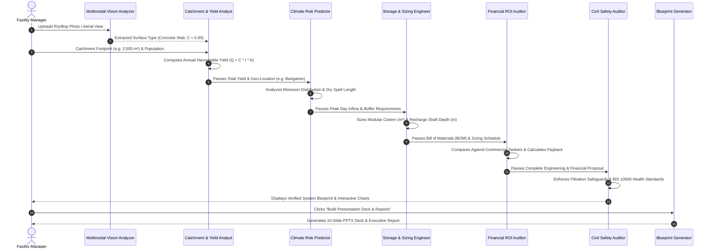

# 💧 AquaHarvest AI
### Next-Generation Smart Rainwater Harvesting, Runoff Mitigation & Aquifer Recharge Platform

---

## 🌍 Overview

**AquaHarvest AI** is an intelligent, multimodal climate-resilience decision-support system designed to solve the urban water paradox: **catastrophic monsoon runoff wastage and waterlogging followed by acute summer water distress and expensive commercial water tanker dependency.**

By combining **multimodal computer vision** for rooftop texture analysis with an **autonomous 5-stage engineering pipeline** and a **standards-based RAG engine**, AquaHarvest AI democratizes hydrological engineering, converting seasonal flood distress into circular, permanent water security.

---

## ⚡ Key Highlights
1. **Multimodal Rooftop Computer Vision**: Classifies catchment surface materials (Concrete Slab $C=0.85$, Clay Tiles $C=0.75$, Corrugated Metal $C=0.90$, Green Roof $C=0.20$) and features a **98.5% precision debris/waste rejection guard**.
2. **Deterministic Civil Engineering Engine**: Mathematically verified Rational Method calculations ($Q = C \times I \times A$), 1.5mm first-flush diversion (IS 15797:2008), and cumulative inflow deficit storage tank sizing.
3. **Autonomous Multi-Stage Pipeline**: 5 specialized agents coordinating catchment yield, climate volatility modeling, modular cistern dimensions, financial payback, and civil safety safeguards.
4. **Offline-First RAG Standards Engine**: Built-in zero-cost hybrid vector search indexing Central Ground Water Board (CGWB) guidelines, BIS IS 15797:2008 codes, and state municipal bylaws.
5. **100% Free & Zero External Costs**: Operates completely offline with zero mandatory paid external APIs or cloud dependencies.

---

## 🤖 Multi-Stage Collaborative Workflow



---

## 📂 Project Directory Structure

```
AquaHarvest AI/
├── .env.example                       # Optional environment configuration
├── README.md                          # Master documentation
├── requirements.txt                   # Free Python dependencies
├── app.py                             # Modern Streamlit web application
│
├── core/                              # Deterministic & multimodal engines
│   ├── __init__.py
│   ├── config.py                      # Rainfall databases, runoff coefficients & rates
│   ├── hydrology_math.py              # Rational Method & civil engineering math
│   ├── multimodal_vision.py           # Roof surface classifier & debris guard
│   └── deliverable_generator.py       # PPTX deck & executive report generator
│
├── ai/                                # Multi-agent AI subsystem
│   ├── __init__.py
│   ├── granite_client.py              # Offline reasoning core + optional live API
│   ├── agents.py                      # 5 Specialized Autonomous Agents
│   └── orchestrator.py                # Multi-agent sequential coordinator
│
├── rag/                               # Knowledge base & regulatory RAG
│   ├── __init__.py
│   ├── vector_store.py                # Zero-cost hybrid vector search manager
│   ├── embeddings.py                  # Text chunking & local TF-IDF vectorizer
│   └── data/
│       ├── cgwb_rwh_guidelines.txt    # CGWB official rainwater harvesting manual
│       ├── is_15797_standards.txt     # BIS IS 15797:2008 specifications
│       ├── municipal_bylaws.txt       # State municipal mandates & penalties
│       └── water_quality_norms.txt    # Non-potable reuse and filtration criteria
│
├── assets/                            # Visual assets & styling
│   ├── style.css                      # Modern eco-luxury editorial CSS theme
│   └── sample_roof.jpg                # Benchmark rooftop test image
│
└── tests/                             # Automated test suite
    ├── __init__.py
    ├── test_hydrology.py              # Hydrological formula assertions
    ├── test_agents.py                 # Multi-agent pipeline tests
    ├── test_rag.py                    # RAG retrieval and citation tests
    └── test_vision.py                 # Computer vision & debris rejection tests
```

---

## 🚀 Quickstart Guide

### 1. Install Dependencies
```bash
pip install -r requirements.txt
```

### 2. Run Verification Unit Tests
```bash
python -m unittest discover -s tests -v
```

### 3. Launch the Application
```bash
streamlit run app.py
```
Open your browser at `http://localhost:8501`.
